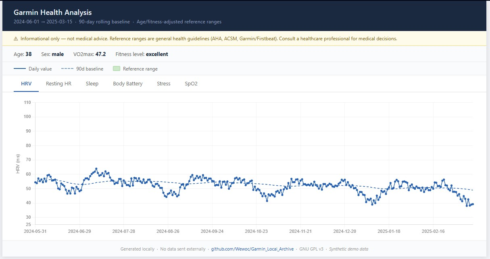

# Garmin Local Archive

> This project is provided as-is under the GNU General Public License v3.0.  
> ⚠️ Early-stage project. While core functionality is stable, APIs and internal structure may change.

* **No Guaranteed Support:** No support, maintenance, or liability is offered. Development happens when time and interest allow.
* **Feedback is Welcome:** If something feels off — logic, structure, or results — open an issue. That kind of feedback is the most useful.
* **Use at Your Own Risk:** Use with caution. I am not responsible for data loss or issues with your Garmin account.

Archive and analyze your Garmin Connect data **locally on your machine — no cloud, no third parties, no US-based AI servers by default**. Everything runs under your control, designed with **privacy in mind, inspired by European principles**.  

Tools like Garmin Chat Connector or Whoop's built-in AI send your data to cloud AI services. This project exists **to give the opposite choice**: your data stays on your machine in open formats you can read, export, and analyze with any tool you choose — local AI, cloud AI, or no AI at all. **Your data, your call.**  

---

## Why this exists

I’m not a software developer — my background is in mechanical system design.
I approach this project as an architect: defining structure, logic, modules and quality rules, while Claude implements the code according to these specifications.

But I wanted what everyone else wanted — to ask an AI questions about my Garmin health data. Sleep, HRV, stress, recovery.

Existing tools send your data to OpenAI, Claude, or other cloud services. Your heart rate, sleep patterns, and fitness data land on additional US company's servers (one is more than enough).

I didn't want that.

So I built this instead — with Claude as my coding partner, from zero, over many iterations. The architecture, module boundaries, data flow, and quality rules are mine — I designed the logic behind every part of this system. I understand what every part does and why — just not every line of how. **Everything runs locally. Nothing leaves your machine.** All data is stored and processed on your own computer. The scripts only fetch data from Garmin Connect, and once downloaded, nothing is transmitted elsewhere. Any AI you choose to use for analysis **can** also run entirely on your hardware. Even without a local AI setup, the built-in dashboards already provide roughly 90% of the insights most users are looking for.

**Note:** the AI itself is not included in this project — the scripts prepare your data in a format suitable for any local AI you choose to use. How to install and use a local AI with your data is explained in the setup guide at the end of this README.

So this project focuses on:
- **local-first data storage** 
- **Privacy & The "Double Cloud" Trap (Privacy first — inspired by European principles)**
- **simple usage (EXE, no setup)**
- **structured data for later analysis (including local AI)**
- **Offline First:** Once the data are on your disk, no further transmission occurs.

## What makes this different

This is not just a data export script.

It is designed to solve a specific problem:

> **Get a complete, consistent local copy of your Garmin data — and keep it that way.**

Garmin erodes your historical data over time. This tool stops it.

| Feature | Garmin Connect | Cloud-AI Bridges (MCP) | **Garmin Local Archive** |
| :--- | :--- | :--- | :--- |
| **Data Storage** | Garmin Servers (USA) | US AI Servers (Anthropic/OpenAI) | **Your Local Machine** |
| **Privacy Risk** | Medium (Corporate) | High (Data used for Training) | **Minimal (Private)** |
| **Access** | Online Only | Requires Internet/Subscription | **100% Offline** |


*Desktop app — settings, sync, export and background timer in one place.*


*Analysis dashboard — daily values vs 90-day personal baseline vs age/fitness-adjusted reference ranges.*

## Design Philosophy

This project intentionally prioritizes:
- Privacy (local-first, no cloud)
- Robust heuristics over fragile assumptions
- Practical reliability over theoretical completeness

Trade-offs:
- No full automated test suite — core modules covered by local test script (`test_local.py`)
- Relies on Garmin's unofficial API
- Designed for personal use, not enterprise environments

## Limitations

- Garmin API may change without notice
- Historical data quality depends on Garmin servers
- Large sync operations are not checkpointed yet

It works. And if I could build it, you are free to use it.

*Built with Claude · If this saved you time — [☕ buy me a coffee](https://ko-fi.com/wewoc) · or leave a [⭐ on GitHub](https://github.com/Wewoc/Garmin_Local_Archive)*

---

## Security & Trust

The full source code is open. If you don't trust the pre-built EXE:

- Read the scripts — or paste them into any AI and ask *"explain what this code does"*
- Build your own EXE: `python build_standalone.py`

The pre-built EXE is unsigned because code-signing certificates cost ~$500/year — money I'd rather spend on coffee. If the Windows security warning concerns you, the scripts are the primary way to run this and always will be.

The pre-built EXE cannot currently be independently verified against the source code without building it yourself. Reproducible CI builds may come in a future version.

---

### Why the token exists — and why it needs protecting

Garmin login works via SSO (Single Sign-On). Every time the collector runs, it needs to authenticate with Garmin Connect. If it does this with email and password on every run, Garmin detects the automated pattern and triggers Captcha or MFA — at which point the collector hangs silently or fails, with no way to recover automatically in the Standalone version.

The solution is token persistence: log in once manually, complete any Captcha or MFA challenge, and Garmin returns an OAuth token. The collector stores this token and uses it for all subsequent runs — no SSO required for approximately one year.

This token is functionally equivalent to a logged-in session. Anyone who obtains it can make Garmin API requests on your behalf. It must not sit unprotected on disk.

---

### How the token is protected

**What the encryption is designed to prevent:**

The primary threat this system is designed against is *accidental exposure* — for example, if your `garmin_data/` folder ends up in a cloud sync (OneDrive, Google Drive, Dropbox), is included in a backup that gets shared, or is accidentally uploaded somewhere. In that scenario, an unencrypted token file would give anyone who finds it direct access to your Garmin account.

**What it is not designed to prevent:**

This system does not protect against an attacker who has already gained full access to your Windows user account. No local desktop application can guarantee that — if your system is compromised, your running sessions, browser cookies, and keyring entries are all potentially accessible regardless of what any individual tool does. This is a system-level boundary, not a flaw specific to this project.

---

### The encryption design

The token is encrypted with **AES-256-GCM** before being written to disk. This provides authenticated encryption: not only is the token unreadable without the key, but any tampering with the file is detected on decryption.

The encryption key is derived from a user-defined string (set once on first setup) using **PBKDF2-HMAC-SHA256 with 600,000 iterations** — the current OWASP recommendation for password-based key derivation. This makes brute-force attacks computationally expensive. The derived key is stored in the **Windows Credential Manager**, which encrypts it using your Windows login credentials. It is never written to disk in plaintext.

**On the salt:**

Each time the token is saved, a fresh 16-byte random salt is generated and stored as the first 16 bytes of the token file. This means the same encryption key produces a different derived AES key on every save — eliminating the fixed-salt weakness present in older versions. If the token file leaks, an attacker cannot pre-compute keys even knowing the encryption scheme.

The trade-off: if the Windows Credential Manager entry is lost (e.g. after a Windows reinstall), re-entering your encryption key is not enough to decrypt an existing token file — the salt that was used is gone with it. This is handled gracefully: the old token is discarded and you log in once manually to generate a new one. No health data is lost — only the cached login session.

**What this achieves in practice:**

- The token file on disk is unreadable without the encryption key
- The encryption key in the WCM is protected by your Windows login
- Plaintext token never exists on disk at any point
- Each save produces a unique ciphertext — no repeated patterns
- If the token file leaks, it is useless without both the key and the WCM entry
- If the WCM entry is lost, a clean re-login restores full access

**What this does not achieve:**

- Protection against malware or an attacker already operating under your Windows account
- This is the same limitation that applies to every password manager, browser, and credential store on the same system

---

### Summary

| Threat | Protected? |
|---|---|
| Token file in cloud backup / accidental upload | ✅ Yes |
| Token file copied from disk without WCM access | ✅ Yes |
| Tampered token file (detected on load) | ✅ Yes |
| Pre-computed key attack (rainbow tables) | ✅ Yes |
| Attacker with full access to your Windows account | ❌ No — system-level boundary |
| Compromised system (malware, remote access) | ❌ No — same for all local tools |

The encryption is not security theatre — it solves the problem it was designed to solve. It just does not solve every possible problem, and it does not claim to.

---

## How it works (simplified)
```
[ Garmin API ]
      │
      ▼
[ garmin_api ]         – token check → SSO login → fetch all endpoints
      │
      ▼
[ garmin_security ]    – encrypt/decrypt OAuth token (AES-256-GCM + WCM key)
      │
      ▼
[ garmin_normalizer ]  – unified schema for any source + summary extraction
      │
      ▼
[ garmin_quality ]     – assess + register in quality_log.json
      │
      ▼
[ garmin_sync ]        – which days are missing?
      │
      ▼
[ garmin_collector ]   – orchestrator → decides → delegates
      │
      ▼
[ garmin_writer ]      – sole owner of raw/ + summary/
      │
      ▼
 [ Local Archive ]
      │
 ┌────┴────┐
 ▼         ▼
[ Exports ] [ Dashboards ]
(AI / JSON) (HTML / Excel)
```

---

## What is included

The collector pipeline (v1.2.2) consists of eight focused modules plus a thin orchestrator. Together with the export and dashboard scripts and the optional desktop app:

| Script | What it does | Reads from |
|---|---|---|
| `garmin_collector.py` | Orchestrates the pipeline — decides, delegates, coordinates | — |
| `garmin_utils.py` | Shared utilities — date parsing, sync date parsing (no project-module dependencies) | — |
| `garmin_config.py` | All configuration — ENV variables, paths, constants | — |
| `garmin_api.py` | Login and all Garmin Connect API calls | Garmin API |
| `garmin_security.py` | Token encryption/decryption — AES-256-GCM, key stored in Windows Credential Manager | `log/` |
| `garmin_quality.py` | Quality assessment and sole owner of `quality_log.json` | `raw/`, `log/` |
| `garmin_sync.py` | Determines which days are missing | `raw/` |
| `garmin_normalizer.py` | Unified data schema across sources + summary extraction | — |
| `garmin_writer.py` | Sole owner of `raw/` and `summary/` — all file writes go through here | — |
| `garmin_import.py` | Bulk import placeholder (not yet implemented) | — |
| `garmin_to_excel.py` | Daily summary spreadsheet — one row per day | `summary/` |
| `garmin_timeseries_excel.py` | Full intraday data per metric as Excel with charts | `raw/` |
| `garmin_timeseries_html.py` | Interactive browser dashboard — zoomable, tabbed, offline | `raw/` |
| `garmin_analysis_html.py` | Analysis dashboard: daily values vs personal baseline vs norm ranges | `summary/` |
| `garmin_app.py` + `build.py` | Optional desktop GUI — run all scripts without terminal or text editor | — |
| `correlation_concept.md` | Designed by curiosity — maybe not part of the pipeline | cosmic knowleg |

Each script is self-contained and designed to be extended. Add new fields, metrics, or analysis logic without touching the rest of the system. See `info/MAINTENANCE.md` for how.

The desktop app (v1.2.2) also includes a **Background Timer** — a fully automatic background sync that repairs failed/incomplete days and fills missing ones while the app is open, without any manual intervention.

Data is stored in three folders:

```
garmin_data/
├── raw/        – complete API dumps (~500 KB/day) — permanent archive
├── summary/    – compact daily JSONs (~2 KB/day)  — for Ollama / Open WebUI / AnythingLLM
└── log/        – session logs and failed days registry
```

---

## Quickstart — which version should I download?

There are three ways to run Garmin Local Archive:

| | Who it's for | Requirements |
|---|---|---|
| **Standalone EXE** | Anyone — no setup needed | Nothing |
| **Standard EXE** | Users comfortable with Python | Python + libraries installed |
| **Scripts only** | Developers | Python + libraries installed |

### Option 1 — Standalone EXE (recommended for most users)

**[⬇ Download Garmin_Local_Archive_Standalone.zip](https://github.com/Wewoc/Garmin_Local_Archive/releases/latest/download/Garmin_Local_Archive_Standalone.zip)**

Extract and double-click `Garmin_Local_Archive_Standalone.exe`.

```
Garmin_Local_Archive_Standalone.exe     ← double-click to launch — nothing else needed
info/                                   ← documentation (optional)
```

No Python, no terminal, no dependencies. Everything is built in.
See `info/README_APP_Standalone.md` for full details.

### Option 2 — Standard EXE (Python required)

**[⬇ Download Garmin_Local_Archive.zip](https://github.com/Wewoc/Garmin_Local_Archive/releases/latest/download/Garmin_Local_Archive.zip)**

Extract and double-click `Garmin_Local_Archive.exe`.

```
Garmin_Local_Archive.exe     ← double-click to launch
scripts/                     ← required, must stay next to the .exe
info/                        ← documentation (optional)
```

Python and the required libraries must be installed on your machine.
See `info/README_APP.md` for full details.

### Option 3 — Scripts only

```bash
pip install garminconnect openpyxl keyring cryptography
python garmin_collector.py
```

Python 3.10 or newer required. See the step-by-step setup below.

---

## Step-by-step setup (scripts)

### Step 1 — Install Python

1. Go to https://www.python.org/downloads/ and download the latest Python 3.x installer
2. Run the installer
3. **Important:** tick **"Add Python to PATH"** before clicking Install
4. Open a terminal (Windows: press `Win+R`, type `cmd`, press Enter) and verify:

```bash
python --version
```

You should see something like `Python 3.13.0`.

---

### Step 2 — Install required libraries

In the terminal, run:

```bash
pip install garminconnect openpyxl keyring cryptography
```

---

### Step 3 — Configure the collector

All configuration is handled via environment variables, read centrally by `garmin_config.py`. The easiest way is to use the desktop GUI (Step 9) — it sets all values automatically.

For script-only use, set the values directly in `garmin_config.py`:

```python
GARMIN_EMAIL    = os.environ.get("GARMIN_EMAIL",    "your@email.com")
GARMIN_PASSWORD = os.environ.get("GARMIN_PASSWORD", "yourpassword")
BASE_DIR        = Path(os.environ.get("GARMIN_OUTPUT_DIR") or "~/garmin_data").expanduser()
```

**Sync mode** — choose how far back to go:

```python
SYNC_MODE = "recent"    # default: last 90 days
SYNC_MODE = "range"     # specific period: set SYNC_FROM and SYNC_TO below
SYNC_MODE = "auto"      # everything since your oldest device (can take hours)
```

---

### Step 4 — Run the collector

```bash
python garmin_collector.py
```

On first run the script will connect to Garmin Connect, detect your registered devices, and download all missing days. Subsequent runs only fetch what's new.

**First run may ask for browser verification** — if Garmin requires a captcha, follow the prompt in the terminal. This only happens once.

---

### Step 5 — Export to Excel (daily overview)

```bash
python garmin_to_excel.py
```

Produces `garmin_export.xlsx` — one row per day, colour-coded by category. Toggle columns on/off in the `FIELDS` block at the top of the script.

---

### Step 6 — Export intraday timeseries (Excel + charts)

```bash
python garmin_timeseries_excel.py
```

Produces one data sheet + one chart sheet per metric. Set the date range in the CONFIG block first.

> For ranges longer than ~30 days the HTML dashboard (Step 7) is faster and more usable.

---

### Step 7 — Interactive HTML dashboard

```bash
python garmin_timeseries_html.py
```

Generates `garmin_dashboard.html` — open in any browser. One tab per metric, fully zoomable, works offline.

---

### Step 8 — Analysis dashboard

```bash
python garmin_analysis_html.py
```

Set your age and sex in the CONFIG block first. Produces:

- `garmin_analysis.html` — daily values vs your 90-day personal baseline vs age/fitness reference ranges
- `garmin_analysis.json` — compact summary for AI tools with flagged days highlighted

> Reference ranges are based on published guidelines (AHA, ACSM, Garmin/Firstbeat) and are informational only — not medical advice.

---

### Step 9 — Desktop app (optional)

**Standard EXE (Python required on target machine):**

```bash
python build.py
```

Produces `Garmin_Local_Archive.exe` + `Garmin_Local_Archive.zip`.

**Standalone EXE (no Python required on target machine):**

```bash
python build_standalone.py
```

Produces `Garmin_Local_Archive_Standalone.exe` + `Garmin_Local_Archive_Standalone.zip`. All scripts and dependencies are embedded — the target machine needs nothing installed.

Both build scripts auto-migrate scripts to `scripts/` and docs to `info/` if they are still in the root folder. Safe to run from any starting layout.

---

### Step 10 — Automate the collector (optional)

**Windows Task Scheduler:**

```powershell
$action  = New-ScheduledTaskAction `
    -Execute "python.exe" `
    -Argument "C:\path\to\scripts\garmin_collector.py"
$trigger = New-ScheduledTaskTrigger -AtLogOn
Register-ScheduledTask -TaskName "GarminCollector" `
    -Action $action -Trigger $trigger -RunLevel Highest
```

**Linux / macOS** (daily at 07:00):

> ⚠️ **Linux / macOS note:** The collector scripts should work on any system with Python 3.10+. The GUI and EXE are Windows-only. Credential storage via `keyring` works on most desktop systems but may need an additional backend on Linux (e.g. `pip install secretstorage`). Headless environments (no desktop session) do not support keyring — store credentials via environment variables instead (`GARMIN_EMAIL`, `GARMIN_PASSWORD`).

```bash
crontab -e
# add this line:
0 7 * * * python3 /path/to/garmin_collector.py >> /path/to/garmin_data/log/collector.log 2>&1
```

---

### Step 11 — AI-assisted analysis (optional)

Connect a local AI model to your health data. Both options run entirely on your machine — your data never leaves your PC.

#### Option A — Open WebUI

1. Install Ollama: https://ollama.com/download
2. Pull a model: `ollama pull qwen2.5:14b`
3. Install Open WebUI via Docker:

```bash
docker run -d -p 3000:8080 --gpus all \
  -v open-webui:/app/backend/data \
  -e OLLAMA_BASE_URL=http://host.docker.internal:11434 \
  --name open-webui --restart always \
  ghcr.io/open-webui/open-webui:cuda
```

4. Open http://localhost:3000 → Workspace → **Knowledge** → **+ New** → point to `garmin_data/summary`
5. In chat: type `#` → select the knowledge base

#### Option B — AnythingLLM

1. Download AnythingLLM Desktop: https://anythingllm.com
2. Connect Ollama (Settings → LLM → Ollama)
3. New Workspace → Upload documents → point to `garmin_data/summary`

#### Which one to choose?

| | Open WebUI | AnythingLLM |
|---|---|---|
| Setup effort | Medium (Docker) | Low (desktop app) |
| Chat interface | Full-featured | Clean, focused |
| Document/RAG quality | Good | Very good |
| Best for | General AI assistant + health data | Primarily health data Q&A |

**Tip:** upload `garmin_analysis.json` directly into a chat for targeted analysis — it contains pre-processed comparisons against your personal baseline and reference ranges.

Example questions:
- *"How was my sleep and HRV last week?"*
- *"Which days had Body Battery below 30?"*
- *"Compare my resting heart rate this month vs last month."*
- *"Based on the analysis file, which metrics need attention and why?"*

---

See `info/MAINTENANCE.md` for full technical documentation, how to add new fields, troubleshooting, and developer notes.

---

## Testing

`test_local.py` covers the core pipeline modules with 98 checks — config, sync, normalizer, quality (including all migrations), writer, collector internals, and the security crypto layer. No network, no API, no GUI required. Run from the project folder:

```bash
python test_local.py
```

GUI changes are verified manually before release. Full CI/CD with automated builds and release packaging is planned for a later version.

---

> ⚠️ **API Usage Notice:** This project uses an unofficial interface. Large-scale data retrieval (e.g., syncing long time ranges in a single run) may trigger rate limiting or temporary IP blocks by Garmin (HTTP 429).
>
> It is recommended to:
> - fetch data in smaller increments
> - include delays between requests
> - allow cool-down periods between sync sessions
