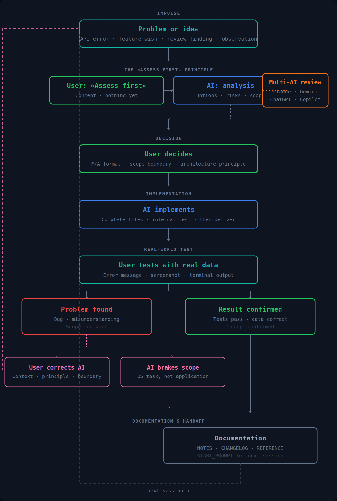
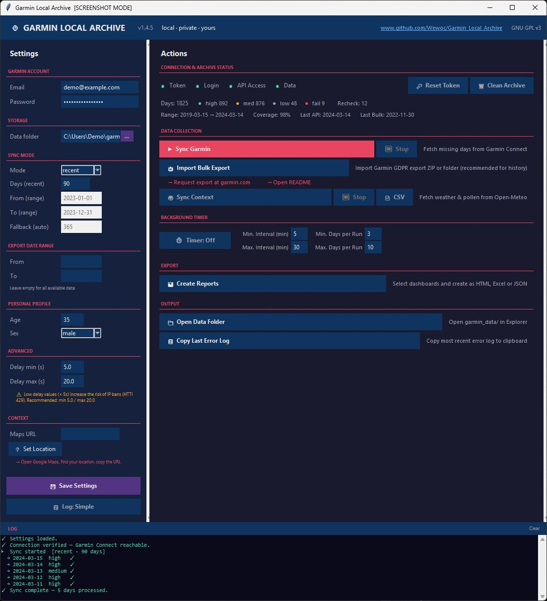
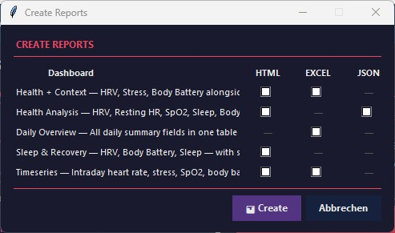

# Garmin Local Archive

Archive and analyze your Garmin Connect data **locally on your machine** — no cloud, no third parties, no subscriptions. Everything runs locally under your control.

---

## Why this exists

I wanted to ask an AI questions about my health data without sending that data to another cloud service. So I built a local alternative instead.

There's a second reason that matters more over time: Garmin deletes your intraday data after roughly 1–2 years. Once it's gone, it's gone permanently. This tool exists to capture it while it's still available.

*→ For the full story, see [MINDSET.md](docs/MINDSET.md).*

---

## What makes this different

This is not a data export script — it maintains a complete, consistent 
local copy of your Garmin data over time. Your data stays in open 
formats, readable and analyzable with any tool you choose. Local AI, 
cloud AI, or no AI at all. **Your data, your call.**

---

## How it works

The app works in two modes: **live sync** pulls recent data directly from Garmin Connect via API; **Bulk Import** loads your complete history from a Garmin GDPR export ZIP — this is the primary path for recovering years of data that the API no longer serves.

Everything is stored locally in structured formats (JSON, Excel, HTML dashboards). Once downloaded, nothing is transmitted anywhere.

The built-in dashboards cover roughly 90% of what most users are looking for — without any AI at all. For deeper analysis, your data is prepared in a format any local AI can work with directly.

| Dashboard | What it shows | Output |
|---|---|---|
| **Health Analysis** | HRV, Resting HR, SpO2, Sleep, Body Battery, Stress — daily values vs 90-day personal baseline vs age/fitness-adjusted reference ranges. Flags days outside range. | HTML, JSON + AI prompt |
| **Timeseries** | Intraday heart rate, stress, SpO2, body battery and respiration as zoomable charts across any date range. | HTML, Excel |
| **Daily Overview** | All summary fields in one flat table, one row per day. | Excel |
| **Health + Context** | Garmin health metrics alongside local weather and pollen data. | HTML, Excel |

The AI itself is not included. How to set one up is explained in the local AI guide at the end of this README.

---

## AI-assisted development

I can't write Python. The architecture, module boundaries, and decisions are mine. Every line of code is Claude's.

It escalated: 30 days, 214 commits, 20 releases.



*→ How this collaboration actually worked — who had which idea, where Claude was wrong — is documented in [MINDSET.md](docs/MINDSET.md).*

---

## Project status & disclaimer

> GNU General Public License v3.0 — provided as-is.

- **Early stage:** Core functionality is stable. APIs and internal structure may still change.
- **No guaranteed support:** Development happens when time and interest allow.
- **Use at your own risk:** I am not responsible for data loss or Garmin account issues.
- **Feedback welcome:** If something feels off — logic, structure, results — open an issue.

---

## Download

| Version | Description | Requires |
|---|---|---|
| [Garmin_Local_Archive_Standalone.zip](https://github.com/Wewoc/Garmin_Local_Archive/releases/latest) | **Recommended — no setup needed** | Nothing |
| [Garmin_Local_Archive.zip](https://github.com/Wewoc/Garmin_Local_Archive/releases/latest) | Standard version | Python 3.10+ |

No install, no terminal. Download, unzip, run.

---

### Recovering your history — Bulk Import

Garmin keeps intraday data (heart rate by second, stress curve, sleep stages) for approximately 1–2 years. After that, only daily aggregates remain. Once it's gone from Garmin's servers, the API can't retrieve it.

The **Bulk Import** feature closes this gap: request your full GDPR data export from Garmin (typically ready in 20–30 minutes), point the app at the ZIP, and your complete history lands in the local archive — in the same format as live API data. Days already present with good quality are skipped automatically.

> Garmin Connect → Settings → Data Management → Export Data

This is what makes the archive genuinely complete, not just a rolling window.

---





*Desktop app — settings, sync, export, bulk import and background timer in one place.*


*Analysis dashboard — daily values vs 90-day personal baseline vs age/fitness-adjusted reference ranges.*

## Scope & limitations

Local-first, personal use, no enterprise ambitions.

- Relies on Garmin's unofficial API — may change without notice. Structural changes are detected and logged automatically (v1.3.4)
- Five local test suites (563 checks + build output validation) — no CI/CD yet
- HTML dashboards require a one-time internet connection to download Plotly (~3 MB) — cached locally after that
- Large sync operations are not checkpointed yet
- Historical data quality depends on Garmin servers

This project is built for my own use. If it happens to be useful to others, feel free to use it — but evaluate it like any other unverified open-source tool.

---

## Token security & Login

Garmin login works via SSO — logging in with email and password on every 
run triggers Captcha or MFA. The solution: log in once manually, and 
Garmin returns an OAuth token that handles all subsequent runs for 
approximately one year. This token is equivalent to a logged-in session 
and must not sit unprotected on disk.

**How it's protected:** The token is encrypted with AES-256-GCM before 
being written to disk. The encryption key is derived from a user-defined 
string using PBKDF2-HMAC-SHA256 (600,000 iterations — current OWASP 
recommendation) and stored in Windows Credential Manager, never on disk 
in plaintext. A fresh random salt on every save means the same key 
produces different ciphertext each time — no pre-computation attacks.

| Threat | Protected? |
|---|---|
| Token file in cloud sync / accidental upload | ✅ Yes |
| Token file copied from disk without WCM access | ✅ Yes |
| Tampered token file | ✅ Yes — detected on load |
| Attacker with full Windows account access | ❌ No — system-level boundary, same for all local tools |

---

## How it works (simplified)
```
[ Garmin API ]
      │
      ▼
[ garmin_api ]         – token check → SSO login → fetch all endpoints
      │
      ▼
[ garmin_security ]    – encrypt/decrypt OAuth token (AES-256-GCM + WCM key)
      │
      ▼
[ garmin_validator ]   – structural check against garmin_dataformat.json
      │
      ▼
[ garmin_normalizer ]  – unified schema for any source + summary extraction
      │
      ▼
[ garmin_quality ]     – assess + register in quality_log.json
      │
      ▼
[ garmin_sync ]        – which days are missing?
      │
      ▼
[ garmin_collector ]   – orchestrator → decides → delegates
      │
      ▼
[ Local Archive ]
      │
      ▼
[ garmin_writer ]      – sole owner of raw/ + summary/
      │
      ▼
 [ garmin_data/ ]


[ Open-Meteo API ]
      │
      ▼
[ context_api ]        – fetches weather + pollen via plugin metadata
      │
      ▼
[ context_writer ]     – sole owner of context_data/
      │
      ▼
 [ context_data/ ]


 [ garmin_data/ ]   [ context_data/ ]
        │                  │
        ▼                  ▼
 [ field_map /      [ context_map /
   garmin_map ]       weather_map /
                       pollen_map ]
        │                  │
        └─────────┬─────────┘
                  ▼
          [ dash_runner ]    – Auto-Discovery → popup → orchestrate
                  │
          ┌───────┼───────┐
          ▼       ▼       ▼
       [HTML]  [Excel]  [JSON + Prompt]
```
```
[ Garmin GDPR Export ZIP ]
      │
      ▼
[ garmin_import ]      – reads ZIP or folder, maps export fields to canonical schema
      │
      ▼
[ garmin_validator ]   – structural check against garmin_dataformat.json
      │
      ▼
[ garmin_normalizer ]  – pure transformation, unified schema
      │
      ▼
[ garmin_quality ]     – assess + register (source: bulk, recheck: false)
      │
      ▼
[ garmin_collector ]   – skip if API high/medium already present
      │
      ▼
[ garmin_writer ]      – sole owner of raw/ + summary/
      │
      ▼
 [ Local Archive ]     – same format as API data, fully compatible
```

> [!TIP]
> **Pipeline Architecture:** For a detailed view of the v1.3.4 data flow including the validation layer and self-healing loop, open [screenshots/flowchart_v134.html](screenshots/flowchart_v134.html) in your browser.

---

## What is included

The project is structured into five focused layers. Each layer has a single responsibility — collect, validate, assess, broker, or render. No crossover between layers.

**Garmin pipeline** — `garmin/`

| Script | What it does |
|---|---|
| `garmin_collector.py` | Orchestrator — decides, delegates, coordinates the full pipeline |
| `garmin_config.py` | All configuration — ENV variables, paths, constants |
| `garmin_utils.py` | Shared utilities — date parsing, no project-module dependencies |
| `garmin_api.py` | Login and all Garmin Connect API calls |
| `garmin_security.py` | Token encryption/decryption — AES-256-GCM, key stored in Windows Credential Manager |
| `garmin_validator.py` | Structural validation against `garmin_dataformat.json` — detects API changes before they reach the normalizer |
| `garmin_normalizer.py` | Unified data schema across sources + summary extraction |
| `garmin_quality.py` | Quality assessment — sole owner of `quality_log.json` |
| `garmin_sync.py` | Determines which days are missing |
| `garmin_writer.py` | Sole owner of `raw/` and `summary/` — all file writes go through here |
| `garmin_import.py` | Garmin GDPR export importer — reads ZIP or folder, feeds each day through the pipeline |

**Context pipeline** — `context/`

| Script | What it does |
|---|---|
| `context_collector.py` | Orchestrates external API collect — date range, location, plugin loop |
| `context_api.py` | Fetches weather and pollen data from Open-Meteo based on plugin metadata |
| `context_writer.py` | Sole owner of `context_data/` — all file writes go through here |
| `weather_plugin.py` | Plugin metadata — Open-Meteo Weather API fields, endpoints, file prefix |
| `pollen_plugin.py` | Plugin metadata — Open-Meteo Air Quality API fields, endpoints, aggregation |

**Data brokers** — `maps/`

| Script | What it does |
|---|---|
| `field_map.py` + `garmin_map.py` | Routes dashboard requests to Garmin data — reads `garmin_data/` |
| `context_map.py` + `weather_map.py` + `pollen_map.py` | Routes dashboard requests to weather/pollen archive — reads `context_data/` |

**Dashboard layer** — `dashboards/` + `layouts/`

| Script | What it does |
|---|---|
| `dash_runner.py` | Auto-discovers specialists, builds report selection popup, orchestrates build |
| `*_dash.py` | Dashboard specialists — fetch data via brokers, return neutral dict for renderers |
| `dash_plotter_*.py` | Format renderers — HTML (Plotly), Excel, JSON + Markdown prompt |
| `dash_layout*.py` | Passive resources — color tokens, CSS variables, disclaimer, prompt templates |

**Desktop app**

| Script | What it does |
|---|---|
| `garmin_app.py` + `build.py` | Desktop GUI + standard EXE build (Python required on target) |
| `garmin_app_standalone.py` + `build_standalone.py` | Desktop GUI + standalone EXE build (no Python required) |

Each module is self-contained and designed to be extended. Add new fields, metrics, or dashboard specialists without touching the rest of the system. See `docs/MAINTENANCE_GLOBAL.md` for how.

The desktop app includes a **Background Timer** — fully automatic background sync that repairs failed/incomplete days and fills missing ones while the app is open, without any manual intervention.

Data is stored in two root folders:

```
garmin_data/
├── raw/        – complete API dumps (~500 KB/day) — permanent archive
├── summary/    – compact daily JSONs (~2 KB/day)  — for Ollama / Open WebUI / AnythingLLM
└── log/        – session logs, quality register, encrypted token

context_data/
├── weather/raw/  – daily weather archive (Open-Meteo)
└── pollen/raw/   – daily pollen archive (Open-Meteo Air Quality)
```

---

## Quickstart — which version should I download?

There are three ways to run Garmin Local Archive:

| | Who it's for | Requirements |
|---|---|---|
| **Standalone EXE** | Anyone — no setup needed | Nothing |
| **Standard EXE** | Users comfortable with Python | Python + libraries installed |
| **Scripts only** | Developers | Python + libraries installed |

### Option 1 — Standalone EXE (recommended for most users)

**[⬇ Download Garmin_Local_Archive_Standalone.zip](https://github.com/Wewoc/Garmin_Local_Archive/releases/latest/download/Garmin_Local_Archive_Standalone.zip)**

Extract and double-click `Garmin_Local_Archive_Standalone.exe`.

```
Garmin_Local_Archive_Standalone.exe     ← double-click to launch — nothing else needed
info/                                   ← documentation (optional)
```

No Python, no terminal, no dependencies. Everything is built in.
See `info/README_APP_Standalone.md` for full details.

### Option 2 — Standard EXE (Python required)

**[⬇ Download Garmin_Local_Archive.zip](https://github.com/Wewoc/Garmin_Local_Archive/releases/latest/download/Garmin_Local_Archive.zip)**

Extract and double-click `Garmin_Local_Archive.exe`.

```
Garmin_Local_Archive.exe     ← double-click to launch
scripts/                     ← required, must stay next to the .exe
info/                        ← documentation (optional)
```

Python and the required libraries must be installed on your machine.
See `info/README_APP.md` for full details.

### Option 3 — Scripts only

```bash
pip install garminconnect openpyxl keyring cryptography
python garmin_collector.py
```

Python 3.10 or newer required. See the step-by-step setup below.

---

## Step-by-step setup (scripts)

### Step 1 — Install Python

1. Go to https://www.python.org/downloads/ and download the latest Python 3.x installer
2. Run the installer
3. **Important:** tick **"Add Python to PATH"** before clicking Install
4. Open a terminal (Windows: press `Win+R`, type `cmd`, press Enter) and verify:

```bash
python --version
```

You should see something like `Python 3.13.0`.

---

### Step 2 — Install required libraries

In the terminal, run:

```bash
pip install garminconnect openpyxl keyring cryptography
```

---

### Step 3 — Configure the collector

All configuration is handled via environment variables, read centrally by `garmin_config.py`. The easiest way is to use the desktop GUI (Step 9) — it sets all values automatically.

For script-only use, set the values directly in `garmin_config.py`:

```python
GARMIN_EMAIL    = os.environ.get("GARMIN_EMAIL",    "your@email.com")
GARMIN_PASSWORD = os.environ.get("GARMIN_PASSWORD", "yourpassword")
BASE_DIR        = Path(os.environ.get("GARMIN_OUTPUT_DIR") or "~/local_archive").expanduser()
```

**Sync mode** — choose how far back to go:

```python
SYNC_MODE = "recent"    # default: last 90 days
SYNC_MODE = "range"     # specific period: set SYNC_FROM and SYNC_TO below
SYNC_MODE = "auto"      # everything since your oldest device (can take hours)
```

---

### Step 4 — Run the collector

```bash
python garmin_collector.py
```

On first run the script will connect to Garmin Connect, detect your registered devices, and download all missing days. Subsequent runs only fetch what's new.

**First run may ask for browser verification** — if Garmin requires a captcha, follow the prompt in the terminal. This only happens once.

---

### Step 5 — Generate dashboards

In the desktop app: click **📊 Berichte erstellen** → select dashboards and formats → confirm.

From the scripts directly:

```bash
python dashboards/dash_runner.py
```

Available dashboards:

| Dashboard | Output | Source |
|---|---|---|
| Timeseries | HTML, Excel | Intraday HR, Stress, SpO2, Body Battery, Respiration |
| Health Analysis | HTML, JSON + Prompt | HRV, Resting HR, SpO2, Sleep, Body Battery, Stress — baseline + reference ranges |
| Daily Overview | Excel | All summary fields, one row per day + Activities sheet |
| Health + Context | HTML, Excel | Garmin health metrics combined with weather and pollen data |

Output is written to `BASE_DIR/dashboards/`. The folder opens automatically after a successful build.

> Reference ranges are based on published guidelines (AHA, ACSM, Garmin/Firstbeat) and are informational only — not medical advice.

> The Health Analysis JSON includes a ready-to-use Markdown start prompt for Open WebUI / Ollama — load `health_garmin_prompt.md` as the system prompt for AI-assisted interpretation.

---

### Step 9 — Desktop app (optional)

**Standard EXE (Python required on target machine):**

```bash
python build.py
```

Produces `Garmin_Local_Archive.exe` + `Garmin_Local_Archive.zip`.

**Standalone EXE (no Python required on target machine):**

```bash
python build_standalone.py
```

Produces `Garmin_Local_Archive_Standalone.exe` + `Garmin_Local_Archive_Standalone.zip`. All scripts and dependencies are embedded — the target machine needs nothing installed.

Both build scripts auto-migrate scripts to `scripts/` and docs to `info/` if they are still in the root folder. Safe to run from any starting layout.

---

### Step 10 — Automate the collector (optional)

**Windows Task Scheduler:**

```powershell
$action  = New-ScheduledTaskAction `
    -Execute "python.exe" `
    -Argument "C:\path\to\scripts\garmin_collector.py"
$trigger = New-ScheduledTaskTrigger -AtLogOn
Register-ScheduledTask -TaskName "GarminCollector" `
    -Action $action -Trigger $trigger -RunLevel Highest
```

**Linux / macOS** (daily at 07:00):

> ⚠️ **Linux / macOS note:** The collector scripts should work on any system with Python 3.10+. The GUI and EXE are Windows-only. Credential storage via `keyring` works on most desktop systems but may need an additional backend on Linux (e.g. `pip install secretstorage`). Headless environments (no desktop session) do not support keyring — store credentials via environment variables instead (`GARMIN_EMAIL`, `GARMIN_PASSWORD`).

```bash
crontab -e
# add this line:
0 7 * * * python3 /path/to/garmin_collector.py >> /path/to/local_archive/garmin_data/log/collector.log 2>&1
```

---

### Step 11 — AI-assisted analysis (optional)

Connect a local AI model to your health data. Both options run entirely on your machine — your data never leaves your PC.

#### Option A — Open WebUI

1. Install Ollama: https://ollama.com/download
2. Pull a model: `ollama pull qwen2.5:14b`
3. Install Open WebUI via Docker:

```bash
docker run -d -p 3000:8080 --gpus all \
  -v open-webui:/app/backend/data \
  -e OLLAMA_BASE_URL=http://host.docker.internal:11434 \
  --name open-webui --restart always \
  ghcr.io/open-webui/open-webui:cuda
```

4. Open http://localhost:3000 → Workspace → **Knowledge** → **+ New** → point to `local_archive/garmin_data/summary`
5. In chat: type `#` → select the knowledge base

#### Option B — AnythingLLM

1. Download AnythingLLM Desktop: https://anythingllm.com
2. Connect Ollama (Settings → LLM → Ollama)
3. New Workspace → Upload documents → point to `local_archive/garmin_data/summary`

#### Which one to choose?

| | Open WebUI | AnythingLLM |
|---|---|---|
| Setup effort | Medium (Docker) | Low (desktop app) |
| Chat interface | Full-featured | Clean, focused |
| Document/RAG quality | Good | Very good |
| Best for | General AI assistant + health data | Primarily health data Q&A |

**Tip:** upload `garmin_analysis.json` directly into a chat for targeted analysis — it contains pre-processed comparisons against your personal baseline and reference ranges.

Example questions:
- *"How was my sleep and HRV last week?"*
- *"Which days had Body Battery below 30?"*
- *"Compare my resting heart rate this month vs last month."*
- *"Based on the analysis file, which metrics need attention and why?"*

---

See `info/MAINTENANCE.md` for full technical documentation, how to add new fields, troubleshooting, and developer notes.

---

## Testing

Five test suites cover the full pipeline — no network, no API, no GUI required:

```bash
python tests/test_local.py          # 218 checks — Garmin pipeline
python tests/test_local_context.py  # 134 checks — Context pipeline (Open-Meteo mocked)
python tests/test_dashboard.py      # 211 checks — Dashboard pipeline
python tests/test_app_logic.py      #  80 checks — App layer (entry points, path resolution)
python tests/test_build_output.py   #   8 sections — Build output validation (run after build)
```

`build_all.py` runs the first three before starting either build — a failing test aborts the build. `test_build_output.py` runs automatically after both builds complete as a post-build gate. `test_app_logic.py` is run manually after changes to the entry point files.

GUI changes are verified manually before release. Full CI/CD with automated builds and release packaging is planned for a later version.

---

> ⚠️ **API Usage Notice:** This project uses an unofficial interface. Large-scale data retrieval (e.g., syncing long time ranges in a single run) may trigger rate limiting or temporary IP blocks by Garmin (HTTP 429).
>
> It is recommended to:
> - fetch data in smaller increments
> - include delays between requests
> - allow cool-down periods between sync sessions

---

*Built with Claude · [☕ buy me a coffee](https://ko-fi.com/wewoc)*
